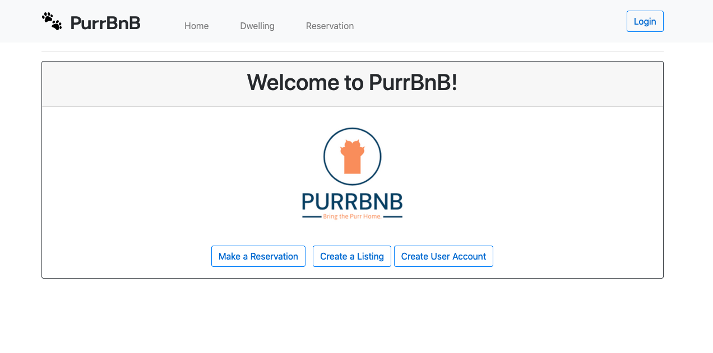

# <p align="center"> 🐾 **Purr BnB** 🐾 </p>

#### _a web-based application to keep track of listed dwellings and pets at PurrBnB using Entity to manage a many-to-many relationship in an SQL database and Identity to manage user Authentication._

#### by **Phil Curran, Anastasia Han, Brit Wallace, Christen Weston, John Whitten** ~ May 2, 2022



## Table of Contents

1. [Technologies Used](#technologies)
2. [Description](#description)
3. [Setup/Installation Requirements](#setup)
4. [Known Bugs](#bugs)
5. [License](#license)
6. [Contact Information](#contact)

## Technologies Used <a id="technologies"></a>

- C#
- .NET 5.0
- MySQL
- ASP.NET Core MVC
- Microsoft.AspNetCore.Identity.EntityFrameworkCore 5.0.0
- Microsoft.EntityFrameworkCore 5.0.0
- Microsoft.EntityFrameworkCore.Design 5.0.0
- Microsoft.NET.Sdk.Web
- Microsoft.NET.Test.Sdk 15.0.0
- MSTest.TestAdapter 1.3.2
- MSTest.TestFramework 1.3.2
- Pomelo.EntityFrameworkCore.MySql 5.0.0-alpha.2

## Description <a id="description"></a>

An app to track treats and special flavors for Pierre's Confectionery. Data is stored in a SQL database and users are authenticated with Identity. Anyone may view the bakery's offerings but only authenticated users may create, update and delete.

### Schema

Add image.

<!--  -->

## Project Setup/Installation Instructions <a id="setup"></a>

### Install C#, .NET, MySQL Community Server and MySQL Workbench

- Open the terminal on your local machine
- If [C#](https://docs.microsoft.com/en-us/dotnet/csharp/) and [.NET](https://docs.microsoft.com/en-us/dotnet/) are not installed on your local device, follow the instructions here [here](https://www.learnhowtoprogram.com/c-and-net-part-time/getting-started-with-c/installing-c-and-net).
- If [MySQL Community Server](https://dev.mysql.com/downloads/mysql/) and [MySQL Workbench](https://www.mysql.com/products/workbench/) are not installed on your local device, follow the instructions [here](https://www.learnhowtoprogram.com/c-and-net-part-time/getting-started-with-c/installing-and-configuring-mysql).
- If [dotnet-ef](https://docs.microsoft.com/en-us/ef/core/cli/dotnet) is not installed on your local device, install it globally with the terminal command `dotnet tool install --global dotnet-ef --version 5.0.2`.

### Clone the project

- Open the terminal on your local computer.
- Navigate to the parent directory of your preference.
- Clone this project using `$ git clone https://github.com/johnwhittenstudio/PierresTreats.Solution`

### Scaffold and connect the database

- Launch the MySQL server with the command `mysql -uroot -p[YOUR-PASSWORD-HERE]`
- Navigate to the directory: `$ cd PierresTreats.Solution`
- Open in Vs code: `$ code .`
- Navigate to the project directory PierresTreats: `$ cd PierresTreats` and type the following command in the terminal `$ touch appsettings.json`
- In the appsettings.json file enter the following code:

```
{
    "ConnectionStrings": {
        "DefaultConnection": "Server=localhost;Port=3306;database=john_whitten_treats;uid=root;pwd=[YOUR-PASSWORD-HERE];"
    }
}
```

- Recreate project environment and install required dependencies with terminal command `$ dotnet restore`
- Build the program with the command `$ dotnet build`
- Scaffold the database with the command `$ dotnet ef database update`

### Run the project

- Run the program with the command `$ dotnet run`

## Known Bugs <a id="bugs"></a>

- _None._

## License <a id="license"></a>

[MIT License](https://opensource.org/licenses/MIT) © 2022 _John Whitten_

## Contact <a id="contact"></a>

Phil Curran [pecurran@hotmail.com](mailto:pecurran@hotmail.com)
Anastasia Han [anastasia.han@yahoo.com](mailto:anastasia.han@yahoo.com) 
Brit Wallace [britwallace888@gmail.com](mailto:britwallace888@gmail.com)
Christen Weston [paleeserecycle@gmail.com](mailto:paleeserecycle@gmail.com)
John Whitten: [johnwhitten.studio@gmail.com](mailto:johnwhitten.studio@gmail.com)


